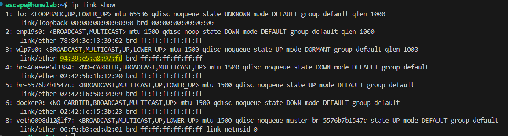
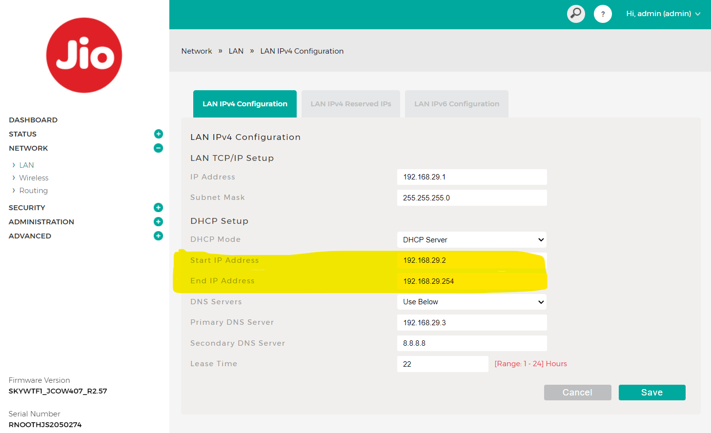
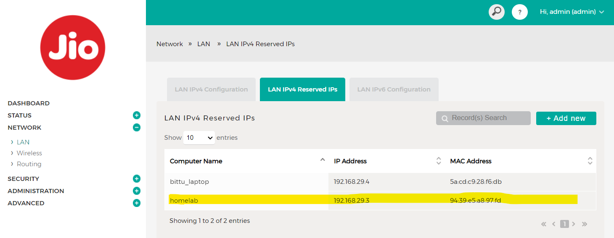
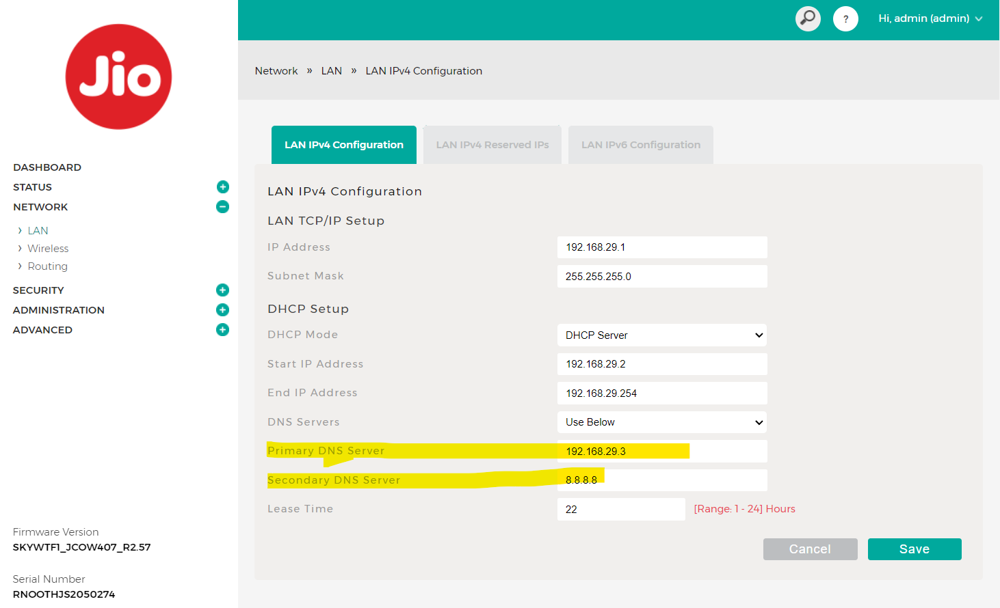
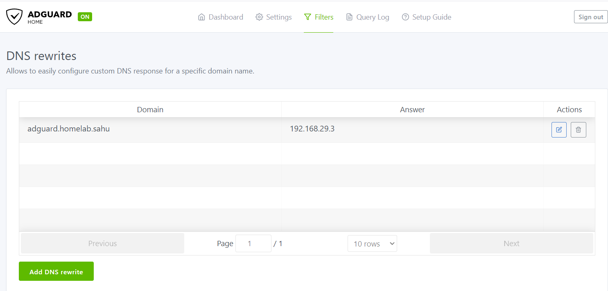
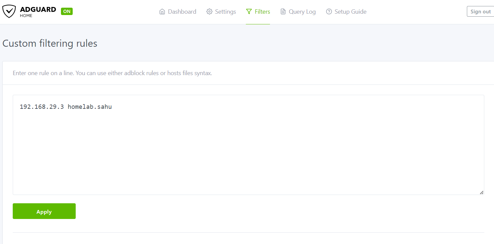

Here's a well-formatted version of your document in Markdown, with a Table of Contents added:

markdown
Copy code
# AdGuard Setup
Steps and issues encountered during the setup of [AdGuard Home](https://github.com/AdguardTeam/AdGuardHome).

---

## Table of Contents
1. [Prerequisites](#prerequisites)
   - [Setup Static IP on Your Machine (DHCP Reservation)](#setup-static-ip-on-your-machine-dhcp-reservation)
   - [Docker and Docker Compose Installation](#docker-and-docker-compose-installation)
2. [Steps](#steps)
3. [Configuration](#configuration)
   - [DNS Rewrite](#dns-rewrite)
   - [Custom Host Filtering](#custom-host-filtering)
4. [Issues](#issues)

---
## Pre-requistic
1. **Setup Static IP on your machine (DHCP Reservation):**
   1.1 Get the MAC address using :
    ```sh
        ip a
    ```  
      
   
   1.2 Decide on an IP address for your machine within the CIDR range of your router, to get cidr login to router setting
     
   
   1.3 Configure it in the router settings:  
         
   
   1.4 Reboot the system.

2. We are using docker and docker compose for installation, so docker and docker compose must be installed 

## Steps:
1. Create adguard folder and we will keep all configuration   thier and traverse to that directory.

2. Run docker compose:
    ```sh
    services:
        adguardhome:
            image: 'adguard/adguardhome:latest'
            container_name: 'adguard'
            hostname: 'adguard'
            restart: 'unless-stopped'
            volumes:
              - '/etc/localtime:/etc/localtime:ro'
              - './work:/opt/adguardhome/work'
              - './config:/opt/adguardhome/conf'
            ports:
              # Plain DNS
              - '53:53/tcp'
              - '53:53/udp'
              # AdGuard Home Admin Panel as well as DNS-over-HTTPS
              - '80:80/tcp'
              - '443:443/tcp'
              - '443:443/udp'
              - '3000:3000/tcp'
              # DNS-over-TLS
              - '853:853/tcp'
              # DNS-over-QUIC
              - '784:784/udp'
              - '853:853/udp'
              - '8853:8853/udp'
              # DNSCrypt
              - '5443:5443/tcp'
              - '5443:5443/udp'
    ```
3. wait for some minutes and it will be up and goto localhost:3000 and follow the instructions

4. Set up router take this as dns server
    

5. Now you are almost done

## Configuration
1. **DNS Rewrite:**  
   Add DNS rewrites as needed for custom domain handling :  
   
   so now you don't have to remember ip address instead dns.

2. Same for host
   


## Issues
1. **[Issue with Port 53 Availability](https://hub.docker.com/r/adguard/adguardhome#resolved-daemon):**  
   Refer to the linked issue for troubleshooting steps.
